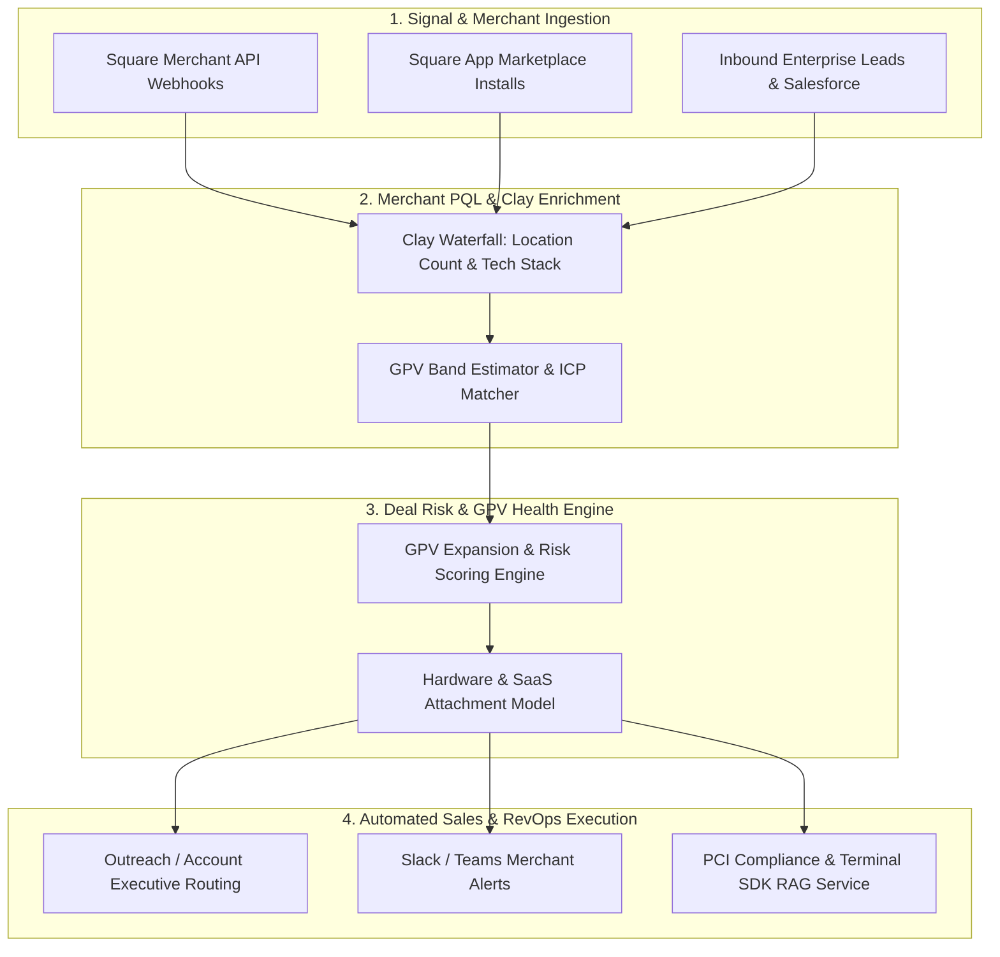

# Square GTM & RevOps Infrastructure Toolkit

A specialized GTM Engineering, AI Agent, and Revenue Operations toolkit custom-built for Square ecosystem workflows—tailored for enterprise merchant acquisition, Gross Payment Volume (GPV) expansion, hardware attachment tracking, and automated technical sales enablement.

---

## 🏗️ Square GTM Architecture Overview



---

## 🛠️ Module Overview

| Category | Module Directory | Key Capabilities |
| :--- | :--- | :--- |
| **GTM Engineering** | `modules/gtm_engineering/ai_agents/` | Merchant API orchestration, Clay enrichment waterfalls, Square App Marketplace triggers |
| **Deal & GPV Scoring** | `modules/gtm_engineering/deal_scoring/` | Algorithmic deal-risk, hardware attachment rate, and GPV potential evaluator |
| **AI Evals & Guardrails** | `modules/gtm_engineering/evaluation_guardrails/` | PCI compliance guardrails, payment data privacy, and Human-in-the-Loop (HITL) specs |
| **RFP & Tech Sales Automation** | `modules/gtm_engineering/rfp_automation/` | Vector retrieval architecture for Square Terminal SDKs, Reader integrations, and security RFPs |
| **SalesOps & Planning** | `modules/salesops/capacity_planning/` | Merchant acquisition funnel modeling, AE capacity, and GPV quota performance |

---

## 📂 Directory Architecture

```text
square-gtm-toolkit/
├── modules/
│   ├── gtm_engineering/
│   │   ├── ai_agents/
│   │   │   └── agent_orchestration_spec.md
│   │   ├── deal_scoring/
│   │   │   └── pipeline_health_model.py
│   │   ├── evaluation_guardrails/
│   │   │   └── ai_eval_framework.md
│   │   └── rfp_automation/
│   │       └── rfp_pipeline_spec.md
│   └── salesops/
│       └── capacity_planning/
└── templates/
    └── architecture_diagrams/
```

---

## 🚀 Getting Started

```bash
# Clone repository
git clone https://github.com/peytonbackus-spec/square-gtm-toolkit.git
cd square-gtm-toolkit

# Run Square deal health & GPV scoring model
python3 modules/gtm_engineering/deal_scoring/pipeline_health_model.py
```
